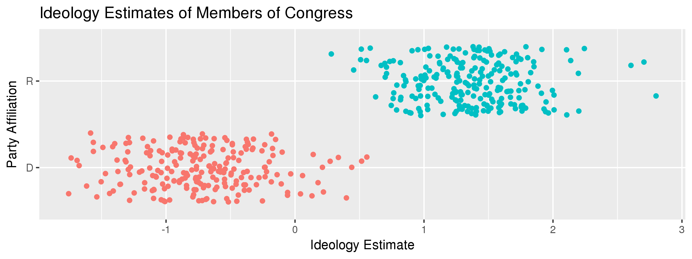

# (One Tweet, Two Tweet,) Red Tweet, Blue Tweet
A data science project studying political polarization on Twitter in May 2017.

## Overview


This is a research project aimed at studying political polarization on Twitter. We focus our attention on the trends observed in the aftermath of President Trump firing FBI Director James Comey, or from May 10th through 29th..

This project has three phases: **data collection**, **ideology estimation**, and **polarization analysis**. At a high level, these are described by:
 * **Data Collection**: collecting tweets on this event, and extracting the retweets and the population of users associated with them.
 * **Ideology Estimation**: estimating the political ideologies of the population through correspondence analysis, and verifying that this ideology is meaningful.
 * **Polarization Analysis**: developing measures of political polarization over time and analyzing them.

## Methods
### Data Collection
This phase uses code from files `01_collect_tweets.py` through `05_extract_retweets.py`. We collected 53 million tweets from 5/10/17 through 5/30/17, focusing on this event. We stored them into a database, then applied spam and activity filters to them. This gave us a corpus of 36 million tweets.

From here, we extracted **27 million retweets**, and the **3 million Twitter users** who were involved in these retweets. This body of retweets and population of users comprised the subject of the following analyses.

### Ideology Estimation
This uses code from files `06_collect_followers.py` through `10_validate_congress.r`. We estimated the political ideology of the 3 million twitter users through a technique called correspondence analysis. We considered which of our users followed 443 political actors (members of Congress and state governors), and used this to predict the ideologies of both our population and of the politicians.

Note that we never explicitly identified any individual's ideology. Therefore, to validate our model, it is statistically sound to compare the estimated ideology of members of Congress with their actual political party:



We see that the estimated ideology strongly correlates with the traditional United States political parties. It is apparent that positive numbers correspond to Republicans and negative numbers to Democrats.

### Polarization Analysis
This uses the last two files, `11_create_heatmaps.r` and `12_analyze_polarization.r`. We first considered, for each retweet on a particular day, the estimated ideologies of the original author and the retweeter. We plotted a heatmap of the joint distrbution, like so:


This showed us that, loosely speaking, liberals retweeted other liberals' tweets and conservatives retweeted other conservatives' tweets. In addition, a group of liberals retweeted conservatives' tweets, but the opposite was not seen. This pattern remained relatively consistent over the course of the analysis (see the plots folder).

Next, we developed various metrics for political polarization. One of these was the average ideological extremity of retweeted information over time, which we display at the top of this page.

This graph makes it apparent that political polarization increases over time. Though the causes are unclear, the manifestation of political polarization over Twitter is apparent.

## Acknowledgements
This project was completed for the [Seminar on Algorithms and Society](http://www.psacomputing.org/algsoc/basics/) course at Northwestern, taught by Prof. Brent Hecht. My work was based on the paper authored by Pablo Barbera at NYU:

```
Barberá, Pablo, et al. "Tweeting from left to right: Is online political communication more than an echo chamber?." Psychological science 26.10 (2015): 1531-1542.
```

In addition, a great deal of my code was based off [theirs](https://github.com/pablobarbera/echo_chambers), for which I am grateful.
