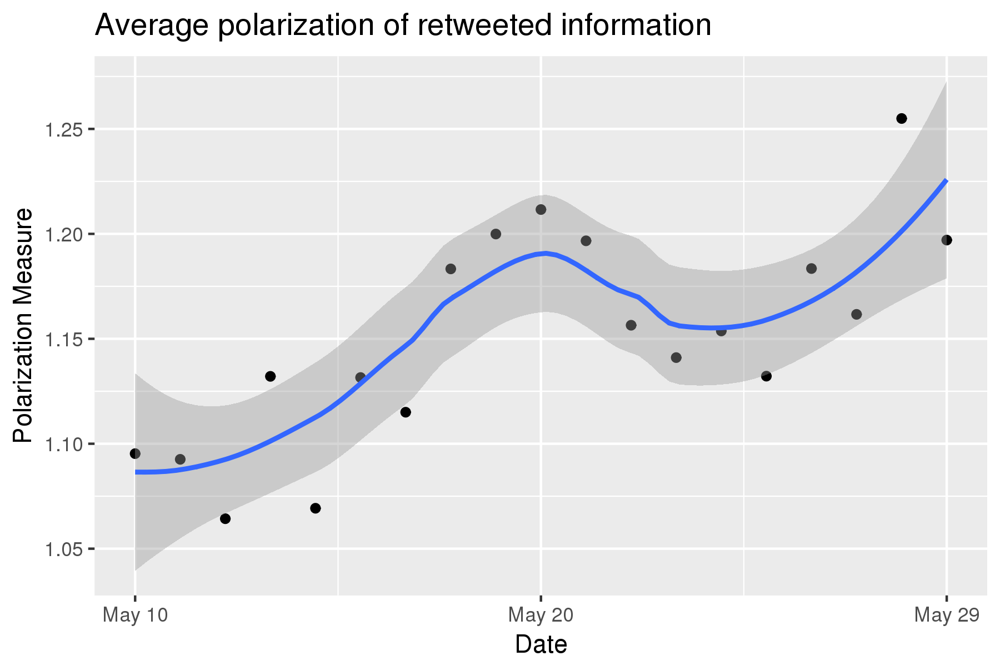
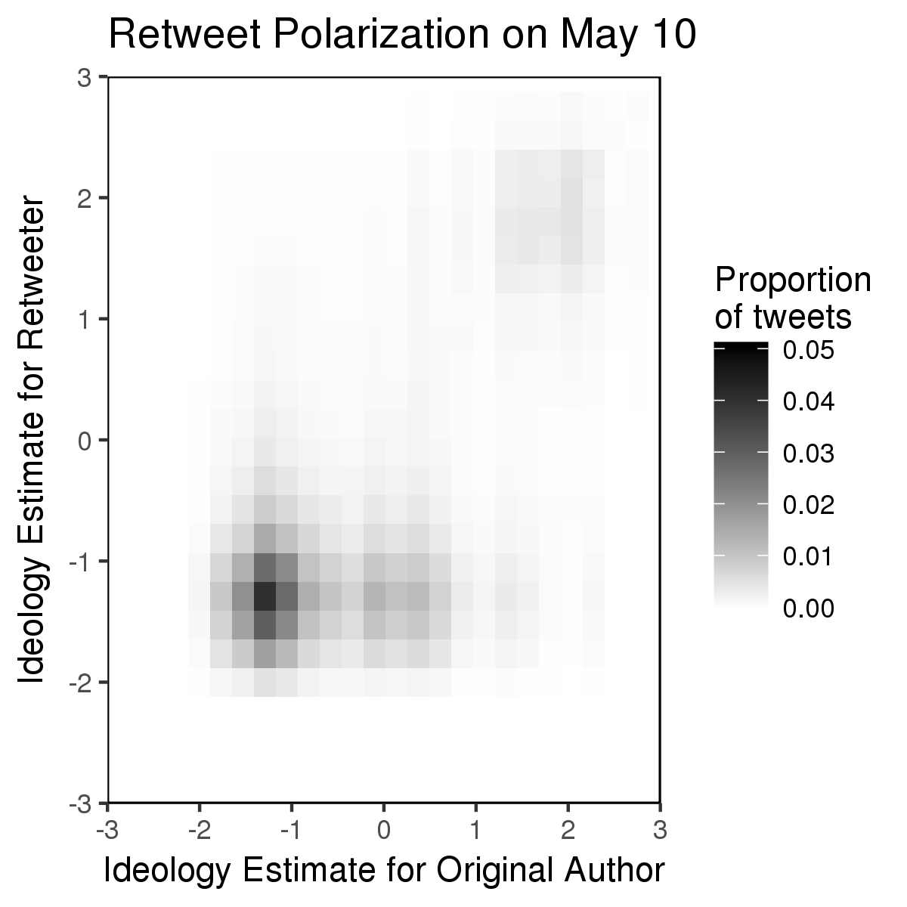

# (One Tweet, Two Tweet,) Red Tweet, Blue Tweet
A data science project studying political polarization on Twitter in May 2017.

## Overview

This is a research project aimed at studying political polarization on Twitter. We focus our attention on the polarization observed in the aftermath of President Trump firing FBI Director James Comey.

To do this, we collected 53 million tweets from May 10th through 30th focused on this event. We applied spam and activity filters to these, giving us a corpus of 36 million tweets. We extracted the **27 million retweets** from these, and the user IDs of the **3 million Twitter users** who were involved in those retweets. This body of retweets and users comprises the subject of this analysis.

We then estimated the political ideology of these Twitter users by considering which political figures (members of Congress and governors) they follow. We used a technique called correspondence analysis to predict the ideologies of both users and politicians without explicitly identifying any individual's or any group's ideology. Using this, we were able to place the majority of our users on a political ideology spectrum.

To verify this model, we used it to predict the ideologies of the members of Congress. Remembering that we never identified political actors as liberal or conservative, we get this plot:

which shows us that our ideology spectrum strongly correlates with the traditional liberal - conservative spectrum.

Finally, we used these estimates to measure political polarization. We generated heatmaps of the joint distributions of the estimated ideologies of the original author and retweeter, like so:

We also developed various measures of political polarization, and measured and analyzed those. One is the average ideological extremity of retweeted information over time, which is displayed at the top of the page.

## Acknowledgements
This project was completed for the [Seminar on Algorithms and Society](http://www.psacomputing.org/algsoc/basics/) course at Northwestern, taught by Prof. Brent Hecht. My work was based on the paper authored by Pablo Barbera, a member of the Social Media and Political Participation Lab at NYU:

    Barberá, Pablo, et al. "Tweeting from left to right: Is online political communication more than an echo chamber?." *Psychological science* 26.10 (2015): 1531-1542.

A great deal of my code was based off [theirs](https://github.com/pablobarbera/echo_chambers), and for this I am grateful.
